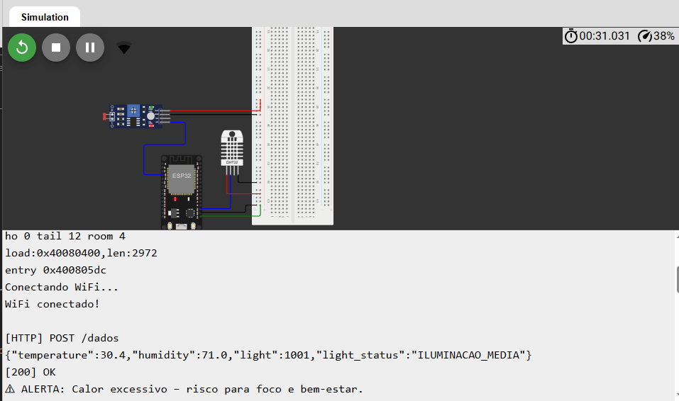

# 🌐 InclusiveWork Station – Estação de Acessibilidade Inteligente  
💡 Monitoramento Ambiental Inclusivo com ESP32 + MQTT + HTTP (Wokwi)

**👉 LINK VÍDEO EXPLICATIVO ->** [Click aqui para acessar ao código. ](COLOCAR LINK) 

**👉 LINK DO CÓDIGO ->** [Click aqui para acessar ao código. ](https://github.com/schiavi18/GS_EDGE/commit/a50cc2f44ad64ff63443dcaa920b8a09f9dd3df5)

**👉 LINK Wokwi ->** [Click aqui para acessar a simulação. ](https://wokwi.com/projects/447550502715140097) 

---

## 📘 1. Visão Geral

A **InclusiveWork Station** é uma solução IoT focada em acessibilidade e inclusão no ambiente de trabalho e estudo.  
Utilizando **ESP32**, **DHT22** e **LDR**, o sistema monitora temperatura, umidade e luminosidade, enviando dados via **MQTT** e simulando requisições **HTTP** no Serial.

O projeto demonstra como tecnologias inteligentes podem melhorar o bem-estar, a inclusão digital e a produtividade de **PCDs** (Pessoas com Deficiência).

---

## 🎯 2. Objetivos do Projeto

- 🚀 Criar uma estação ambiental acessível para home office e estudo;  
- 📡 Enviar dados ambientais em tempo real via MQTT;  
- 🌐 Simular integração HTTP por meio de logs estruturados;
- ⚠ Detectar condições impróprias (calor, pouca luz, umidade irregular); 
- 🦾 Ajudar especialmente pessoas cegas, surdas ou com hipersensibilidade;

---

## 🛠 3. Componentes Utilizados (Wokwi)

- 🧠 **ESP32**  
- 🌡 **Sensor DHT22** (temperatura e umidade)  
- 🔆 **Sensor LDR** (luminosidade)  
- 📶 WiFi (Wokwi-GUEST)

---

## 📚 4. Bibliotecas Utilizadas

- `WiFi.h`  
- `DHT.h`  
- `HTTPClient.h`  
- `PubSubClient.h`  

---

## 🔧 5. Funcionalidades Principais

- 📊 Leitura de temperatura, umidade e luz a cada 3s;  
- 💡 Classificação automática da luminosidade:
  - 🌑 Ambiente escuro  
  - 🌥 Iluminação média  
  - ☀ Ambiente claro  
- 📡 Envio de dados MQTT no tópico `inclusivework/dados`; 
- 🌍 Logs HTTP simulados no Serial.  
- 🚨 Alertas inteligentes quando:
  - 🔥 Temperatura é alta  
  - 🌚 Ambiente está muito escuro  

---

## ✅ Projeto enviando e recebendo dados 

## 👩‍💻 Desenvolvedores 

- Julia Schiavi | RM: 562418
- Josue Faria | RM: 563819
